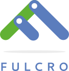

:source-highlighter: coderay
:source-language: clojure
:toc:
:toc-placement: preamble
:sectlinks:
:sectanchors:
:sectnums:



image:https://img.shields.io/clojars/v/fulcrologic/fulcro.svg[link=https://clojars.org/fulcrologic/fulcro]
image:https://circleci.com/gh/fulcrologic/fulcro/tree/master.svg?style=svg["CircleCI", link="https://circleci.com/gh/fulcrologic/fulcro/tree/master"] (release)
image:https://circleci.com/gh/fulcrologic/fulcro/tree/develop.svg?style=svg["CircleCI", link="https://circleci.com/gh/fulcrologic/fulcro/tree/develop"] (develop)

Fulcro is a library for building data-driven full-stack applications for the web. It uses React, is written in
Clojure and Clojurescript (so it has first-class functional abilities with immutable data) which leads to a clean
synchronous story for the UI. The primary design goals are:

. Provide structure and patterns that encourage simplicity in overall design.
. Provide an out-of-the box experience that is as easy as possible, except where it conflicts with the first goal.

*NOTE*: If you are using Java 9, you may need to include "--add-modules java.xml.bind" to your JVM.

== Version Differences

Fulcro has undergone a number of face-lifts over its lifetime.

[[Horizontal]]
1.x:: An add-on library for Om Next. Has various limitations as a result of this, and several bugs that are deep within Om Next (which was not getting updates).
2.0 - 2.4:: No longer depends on Om Next. Public API is the same, except where improvements and fixes were needed.
2.5:: Integrated co-located CSS for better support (e.g. localized-dom), made all server dependencies dynamic, rewrite of i18n. This
version requires you to change a few i18n things if you were using it, and adds API to the DOM to make UI much more concise.

== A Bare Bones Example

=== The Project File

Here is a minimal project file for a Fulcro app with hot code reload on the client. In `project.clj`:

```
(defproject app "0.1.0-SNAPSHOT"
  :dependencies [[org.clojure/clojure "1.9.0"]
                 [org.clojure/clojurescript "1.10.238"]
                 [fulcrologic/fulcro "2.5.0"]]

  :plugins [[lein-figwheel "0.5.15"]]

  :cljsbuild {:builds
              [{:id           "dev"
                :figwheel     {:on-jsload "app.main/refresh"}
                :source-paths ["src"]
                :compiler     {:main       app.main
                               :asset-path "js/dev"
                               :output-dir "resources/public/js/dev"
                               :output-to  "resources/public/js/app.js"}}]})
```

=== A Base HTML Page

You need a small amount of HTML to load the application and give it a div to mount on. Put it in `resources/public/index.html`:

```html
<!DOCTYPE html>
<html>
    <body>
        <div id="app"></div>
        <script src="js/app.js"></script>
    </body>
</html>
```

=== A Trivial Component

Writing components is what you're here to do! This is the simplest one you can write. Put it in `src/app/ui.cljs`:

```
(ns app.ui
  (:require
    [fulcro.client.primitives :as prim :refer [defsc]]
    [fulcro.client.dom :as dom]))

(defsc Root [this props]
  (dom/div "Hello world"))
```

=== The Entry Point

For figwheel development you'll need an entry point that creates an application, and also a function that can be
called to refresh the UI on hot code reload. Put this in `src/app/main.cljs`:

in `app/main.cljs`:

```
(ns app.main
  (:require
    [app.ui :refer [Root]]
    [fulcro.client :as fc]))

(defonce client (atom (fc/new-fulcro-client)))

(swap! client fc/mount Root "app")

(defn refresh [] (swap! client fc/mount Root "app"))
```

The client is held in a `defonce` atom so that hot code` reload doesn't reinitialize the entire program. One of the
huge advantages of working with Clojurescript and React is the support for trivial hot code updates without losing
your spot in development.

Notice back in the project file that this namespace is referred to, and the js load instruction for figwheel points
to this refresh function. Fulcro `mount` puts your UI on the element with the given ID, and calling it when the thing
is already mounted just refreshes it.

Run:

```bash
$ lein figwheel
```

and you should see it compile and wait for you to attach your browser (at http://localhost:3449[localhost:3449]).

=== A Look At More Detail

You'll need to understand a number of new concepts to really use Fulcro, but we can give you a bit more of a taste
for it.

Here are the minimal facts you must know:

* Fulcro applications manage an internal graph database that holds all of your application's data.
* Components have queries that pull data from that database, so they can render it.
* Fulcro's query syntax and networking facilities allow you to do graph queries to servers to populate your database with very little glue code.

So, let's improve the application a bit. Change `main.cljs` to this:

```
(ns app.ui
  (:require
    [fulcro.client.primitives :as prim :refer [defsc]]
    [fulcro.client.dom :as dom]))

(defsc Root [this {:keys [n]}]
  {:query         [:n]
   :initial-state {:n 1}}
  (dom/div (str "My number is " n)))
```

We've added some initial state for this component (which goes in the client database...this is not React state), and
a query for that state. This is the root component, so the state of this component goes in the root of the database. The
query is therefore equally trivial...query for `:n`.

After figwheel compiles this, you'll notice that your UI is wrong. This is because hot code reload doesn't reinitialize the
application (for good reason). If you want the initial state to be in your database, you'll have to refresh the browser.

=== Modifying State

Modifications to state (locally and remotely) are unified with a single abstract mutation. Mutations in Fulcro are
*data*. They look like function calls, but are in fact abstract instructions from the UI that are interpreted and
processed separately. You queue them for execution with `transact!`, and you handle them with `defmutation`.

Here's a basic one, which for convenience we'll write in `ui.cljs` (typically you'd have a separate namespace for these to
keep logic separate from your UI):

```
(ns app.ui
  (:require
    [fulcro.client.primitives :as prim :refer [defsc]]
    [fulcro.client.mutations :as m :refer [defmutation]] ; The namespace require
    [fulcro.client.dom :as dom]))

;; The mutation
(defmutation bump-number [{:keys [new-n] :as params}]
  (action [{:keys [state]}]
    (swap! state assoc :n new-n)))

(defsc Root [this {:keys [n]}]
  {:query         [:n]
   :initial-state {:n 1}}
  (dom/div
    (str "My number is " n)
    ;; Running the mutation
    (dom/button {:onClick #(prim/transact! this `[(bump-number {:new-n ~(inc n)})])} "Make it Bigger!")))
```

Once hot code reload has happened you should have a working button that increments your number. The
state atom is the application's graph database. It is made up of normal Clojurescript
data structures, and is itself a map.

=== Full Stack

Fulcro's abstractions are tuned and ready for full-stack operation. First, add some dependencies to `project.clj`:

```
(defproject app "0.1.0-SNAPSHOT"
  :dependencies [[org.clojure/clojure "1.9.0"]
                 [org.clojure/clojurescript "1.10.238"]
                 [fulcrologic/fulcro "2.5.0"]

                 ;; add these:
                 [http-kit "2.2.0" :scope "provided"]
                 [ring/ring-core "1.6.3" :scope "provided" :exclusions [commons-codec]]
                 [bk/ring-gzip "0.2.1" :scope "provided"]
                 [bidi "2.1.3" :scope "provided"]]

   ... as before
```

and then add a `src/app/server.clj`:

```
(ns app.server
  (:require
    [com.stuartsierra.component :as c]
    [fulcro.server :refer [defquery-root defmutation]]
    [fulcro.easy-server :as s]))

(defmutation app.ui/bump-number [{:keys [new-n]}]
  (action [env]
    (println "Bump number to " new-n)))

(defquery-root :n
  (value [env params] 100))

(def server (s/make-fulcro-server :config-path "config/defaults.edn"))

(defn go []
  (c/start server))
```

You can run this server with

```bash
$ lein repl
user=> (require 'app.server)
user=> (app.server/go)
```

You should now be able to access your app from http://localhost:8080. Figwheel hooks things up to work right, so you'll
still get hot code cljs reload. Server changes will require a server restart. Hot code reloading on the server is beyond this
intro, and is solved identically to all other Clojure servers.

Notice that we've added a `defmutation` and a query handler (`defquery-root`) to the server. Let's see how we can leverage
those.

Change the `defonce` in `main.cljs` to look like this:

```
; You'll need to add fulcro.client.data-fetch as df to your requires
(defonce client (atom (fc/new-fulcro-client
                        :started-callback (fn [app]
                                            (df/load app :n nil {:marker false})))))
```

This tells the client to issue a load to the server for root prop `:n`. That, and the `defquery-root` on the server are all that's
required! The `nil` parameter is actually a place for a component, allowing you to load sub-graphs of data based on component
queries! It's a very powerful and generalized mechanism.

Now change the mutation in `ui.cljs` to this:

```
(defmutation bump-number [{:keys [new-n] :as params}]
  (action [{:keys [state]}]
    (swap! state assoc :n new-n))
  (remote [env] true))
```

That's it! One additional line and you've made your mutation full-stack. Reload your app and you should see the number very quickly
go from 1 to 100 (initial to the result of the load), and the button should show log messages on your server about
the new number.

To get all of the benefits from Fulcro, you'll have to learn about the graph database, queries, and component composition. But
we hope you'll take the time. We're continually surprised at how powerful and flexible the model has turned out
to be, and assure you that learning about it is time well spent.

Contact us on the http://clojurians.net/[`#fulcro` Slack channel] for help!

=== Further Information

The https://fulcrologic.github.io/fulcro[website] is a great place to read about
Fulcro. It has pages describing things in more general terms, and has links
to various resources like videos and evaluation guides.

New users are encouraged to do one or both of the following:

. Follow along with the https://www.youtube.com/playlist?list=PLVi9lDx-4C_Rwb8LUwW4AdjAu-39PHgEE[YouTube] video series.
. Read the https://book.fulcrologic.com[Developer's Guide]
. Do the devcards-based https://github.com/fulcrologic/fulcro-tutorial[Fulcro Tutorial].

=== Leiningen Template

Experienced users that want to dive right in can use the `lein` template. This template will save you a lot of effort
in green-field development, as it emits a project that is already set up with
full-stack support, development modes, testing (including CI), uberjar, i18n, and even
devcards support:

```
lein new fulcro my-project nodemo
```

It generates a lein-based project (of course), but has options that let you choose between build systems:

* figwheel (default) - Generates a project that uses Figwheel for hot code reload in development mode, and the standard
cljs compiler.
* shadow-cljs - Generates a project that uses shadow-cljs for the compiler and development environment. This is a great
alternative that replaces figwheel for hot code reload and is a fork of the standard cljs compiler that has much
better support for the native js ecosystem (i.e. npm). I generally recommend this to consulting clients for business
use, since leveraging external libraries is often a critical cost concern.

The `demo` and `nodemo` options cause the template to include some very basic example code (or not). If you don't choose
one of those, it will ask.

So, to generate a shadow-cljs project with demo code:

```
lein new fulcro my-project demo shadow-cljs
```

If you don't know Clojure, you should at least get comfortable with the basics.
I recommend: http://www.braveclojure.com/[Clojure for the Brave and True], and doing at least the
basic online exercises at http://www.4clojure.com/[4Clojure]. You should also have
a passing familiarity with Facebook's React, though if you understand that we're
using it to get "fast UI updates", that is sufficient to start.

== Contributors

Fulcro is maintained by Fulcrologic, LLC. The primary architect and maintainer is Tony Kay.

Fulcro expands on the work of David Nolen's Om Next, and that code represents about 30% of 2.0's code base.
Much of the core API is similar, but this
library is intended to be an easier-to-use alternative that follows the original simplicity of design while eliminating
some experimental features of that library, and rounding out the story with a complete concrete implementation
that is easy to use.

Many people have contributed to this library. Much of the original internal work was part of Om Next and
as written by David Nolen. Some of the contributions of Antonio Monteiro have also been incorporated.

Fulcro itself originated as an effort of Navis in Bend, Oregon. Tony Kay was the primary architect, and numerous people
contributed in that original project (known as Untangled).

Fulcro can therefore be considered a fork of Untangled and Om Next.

See the github statistics for information on all contributors.

== Join us on Slack!

We have an active and very helpful community on Slack. Please join us!

Get an invite from here:

https://clojurians.herokuapp.com/

Follow the instructions to get into Slack, and find us in the `#fulcro` channel.

== Copyright and License

Source code obtained from Om Next is:

Copyright © 2013-2017 David Nolen

Licensed under the Eclipse Public License.

Fulcro is:

Copyright (c) 2017, Fulcrologic, LLC
The MIT License (MIT)

Permission is hereby granted, free of charge, to any person obtaining a copy of this software and associated
documentation files (the "Software"), to deal in the Software without restriction, including without limitation the
rights to use, copy, modify, merge, publish, distribute, sublicense, and/or sell copies of the Software, and to permit
persons to whom the Software is furnished to do so, subject to the following conditions:

The above copyright notice and this permission notice shall be included in all copies or substantial portions of the
Software.

THE SOFTWARE IS PROVIDED "AS IS", WITHOUT WARRANTY OF ANY KIND, EXPRESS OR IMPLIED, INCLUDING BUT NOT LIMITED TO THE
WARRANTIES OF MERCHANTABILITY, FITNESS FOR A PARTICULAR PURPOSE AND NONINFRINGEMENT. IN NO EVENT SHALL THE AUTHORS OR
COPYRIGHT HOLDERS BE LIABLE FOR ANY CLAIM, DAMAGES OR OTHER LIABILITY, WHETHER IN AN ACTION OF CONTRACT, TORT OR
OTHERWISE, ARISING FROM, OUT OF OR IN CONNECTION WITH THE SOFTWARE OR THE USE OR OTHER DEALINGS IN THE SOFTWARE.
