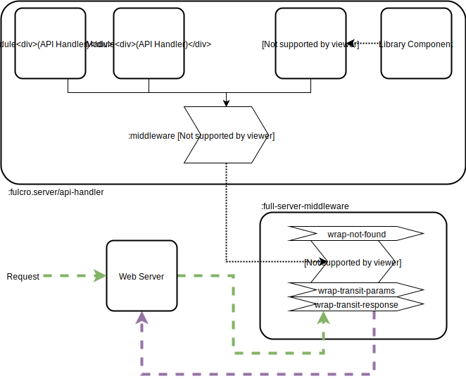

Fulcro Reference Guide
=======================
:author: Tony Kay
:revdate: July 28, 2017
:revnumber: 1.0
:lang: en
:encoding: UTF-8
:doctype: book
:source-highlighter: coderay
:source-language: clojure
:toc:
:toclevels: 2
:sectlinks:
:sectanchors:
:sectnums:

ifdef::env-github[]
:tip-caption: :bulb:
:note-caption: :information_source:
:important-caption: :heavy_exclamation_mark:
:caution-caption: :fire:
:warning-caption: :warning:
endif::[]

ifdef::env-github[]
toc::[]
endif::[]

= About This Book

This book is meant to serve as a guide for Fulcro developers that have already gone
through the Developer's Guide tutorial and understand the core principles of
Fulcro. This book is organized by topic, and is not in order or importance. It
gives a greater level of detail on each topic and assumes you have at least
a passing knowledge of all of the core concepts and topics.

The first chapter does go over the core concepts to aid the reader in
additional clarifications about the model and design critical to Fulcro.

= Core Concepts

== Immutable Data Structures

Many of the most interesting and compelling features of Fulcro are directly or
indirectly enabled (or made simple) by the use of persistent data structures
that are a first-class citizen of the language.

In imperative programming languages like Java and Javascript you have no idea what
a function or method might do to your program state:

[source,java]
-----
Person p = new Person();

doSomethingOnAnotherThread(p);

p.fumble();

// did p just change??? Did I just cause a race condition???
-----

This leads to all sorts of subtle bugs and is arguable the source of many problems
in software today. What if `Person` couldn't change and you instead had to copy
instead if you wanted to modify?

[source,java]
-----
Person p = new Person();

doSomethingOnAnotherThread(p);

Person q = p.fumble();

// p is definitely unchanged, but q could be different
-----

Now you can reason about what will happen. The other thread will see `p` exactly as
it was when you (locally) reasoned about it. Furthermore, `q` cannot be affected
because if `p` is truly "read-only" then I still know what it is when I use it to
derive `q` (the other thread can't modify it either).

In order to derive these benefits, you need to either write objects that enforce
this behavior (which is highly inconvenient and hard to make efficient
in imperative langauges), or use a programming language that supplies the ability
to do so as a first-class feature.

Another benefit is that persistent data structures can do *structural sharing*. Basically
the new version of a map, vector, list, or set can use references to point to any
parts of the old version that are still the same in the new version. This means,
for example, that adding an element to the head of a list that had 1,000,000 entries
(where only one is being changed) is still a constant time operation!

Here are some of the features in Fulcro that result from using persistent data structures:

. A Time-travel UI history viewer that consumes little space.
. Extremely efficient detection of data changes that affect the UI (can be ref compare instead of data compare)
. Really effective "Pure Rendering"

== Pure Rendering

Fulcro uses Facebook's React to accomplish updates to the browser DOM. React, in
concept, is really simple:

Render is a function you make that generates a data structure known as the
VDOM (a lightweight virtual DOM)

. On The first "frame", the real DOM is made to match this data structure.
. On every subsequent frame, render is used to make a new VDOM. React
compares the prior VDOM (which is cached) to the new one, and then applies the
changes to the DOM.

The cool realization the creators of React had was that the DOM operations
that are slow and heavy, but there are efficient ways to figure out what
needs to be changed via the VDOM without you having to write a bunch of
controller logic.

Now, because React lives in a mutable space (Javascript), it allows all sorts of things
that can embed "rendering logic" within a component. This sounds like a good
idea to our OOP brains, but consider this:

What if you could have a complete snapshot of the state of your application, pass
that to a function, and have the screen just "look right". Like writing a 2D game: you
just redraw the screen based on the new "state of the world". All of the sudden your
mind shifts away from "bit twiddling" to thinking more about the representation
of your model with minimal data!

That is what we mean by "pure rendering".

[[PureRenderingDiagram]]
[ditaa, target=rendering]
....

   /-------\   /-------\   /-------\   /-------\
   | state |-->| state |-->| state |-->| state |
   \-------/   \-------/   \-------/   \-------/
       |           |           |           |
       |render     |render     |render     |render
       |           |(diff)     |(diff)     |(diff)
       v           v           v           v
   /-------\   /-------\   /-------\   /-------\
   |  DOM  |   |  DOM  |   |  DOM  |   |  DOM  |
   \-------/   \-------/   \-------/   \-------/
....


Here's an example to whet your appetite: Nested check-boxes.
In imperative programming each checkbox has it's own state, and when we want a "check all"
we end up writing nightmares of logic to make sure the thing works right because we're
having to *store a mutable value* into an object that then does the rendering.
Then we play with it and find out we
forgot to handle that event where some sub-box gets unchecked to
fire an event to ensure to uncheck the "select all"...oh wait, but when I do that
it accidentally fires the event from "check all" which unchecks everything
and then goes into an infinite loop!

What a mess! Maybe you eventually figure out something that's tractable, but
that extra bit of state in the "check all" is definitely the source of bugs.

Here's what you do in pure rendering with immutable data:

Each sub-item checkbox is a simple data structure with a `:checked?` key that has a boolean
value. You use that to directly tell the checkbox what it's state should be
(and React enforces that...making it impossible for the UI to draw it any
differently)

```
(def state {:items [{:id :a :checked? true} {:id :b :checked? false} ...]})
```

For a "state of the world", these are read-only. (you have to make a "new
state of the world" to change one). When you render, the state of the
check-all is just the conjunction of it's children's `:checked?`:

[source,clojure]
----
(let [all-checked (every? :checked? (get state :items)]
   (dom/input #js {:checked all-checked}))
----

The check-all button would have *no application state at all*, and React will
force it to the correct state based on the calculated value.
When the sub-items change, a new "state of the world"
is generated with the altered item:

```
(def next-state (assoc-in state [:items 0 :checked?] false))
```

and the *entire* UI is re-rendered (React makes this fast
using the VDOM diff), the "check all" checkbox will just be
right!

If the "check all" button is pressed, then the logic is similarly very simple:
change the state for the subitems to checked if any were unchecked, or set them
all to unchecked if they were all checked:

```
(def next-state-2
  (let [all-checked? (every? :checked? (get state :items))
        c            (not all-checked?)
        old-items    (get state :items)
        new-items    (mapv #(assoc % :checked? c) old-items)]
    (assoc state :items new-items)))
```

and again you get to pretend you're rendering an entire new frame on the screen!

You'll be continually surprised at how simple your logic gets in the UI once you
adjust to this way of thinking about the problem.

== Data-Driven

Data-driven concepts were pioneered in web development by Facebook's GraphQL and
Netflix's Falcor. The idea is quite powerful, and eliminates huge amounts of
complexity is your network communication and application development.

The basic idea is this: Your UI, which might have various versions (mobile, web, tablet)
all have different but related data needs. The prevalent way of talking to our
servers is to use REST, but REST itself isn't a very good query 'or' update
language. It creates a lot of complexity that we have to deal with in order
to do the simplest things. In the small, it is "easy". In the large, it isn't
the best fit.

Data-driven applications basically use a more detailed protocol that allows the
client UIs to specify what they need, and also typically includes a "mutation
on the wire" notation that allows the client to abstractly say what it
needs the server to do.

So, instead of `/person/3` you can instead say "I need person 3, but only their
name, age, and billing info. But in the billing info, I only need to know their
billing zip code".

Notice that this abstract expression (which of course has a syntax we're
not showing you yet) is "walking a graph". This is why Facebook calls their language
"GraphQL".

You can imagine that the person and billing info might be stored in two tables
of a database, with a to-one relationship, and our query is basically asking
to query this little sub-graph:

[ditaa,graph-query-abstract]
....
[person: age? name?]--->[billing info: zip?]
....

Modifications are done in a similar, abstract way. We model them as if
they were "function calls on the wire". Like RPC/RMI:

```
'(change-person {:id 3 :age 44})
```

but instead of actually 'calling' the function, we encode this list as
a data structure (it is a list containing a symbol and a map: the power of Clojure!) and then process that
data locally (in the back-end of the UI) and optionally also
transmit it 'as data' over the wire for server processing!

== Graph Database [[GraphDB]]

The client-side of Fulcro keeps all relevant data in a simple graph database, which
is referenced by a single top-level atom. The database itself is a persistent map.

The database should be thought of as a root-level node (the top-level map itsef),
and tables that can hold data relevant to any
particular component or entity in your program (component or entity nodes).

[ditaa,target=dbmodel]
....
+-------------------+
| prop     42       |
|                   |
| table  { ID val   |
|          ... }    |
| table  { ID val   |
|          ... }    |
|                   |
+-------------------+
....

The tables are also simple maps, with a naming convention and well-defined structure.
The name of the table is typically namespaced with the "kind" of thing you're storing,
and has a name that indicates the way it is indexed:

```
{ :person/by-id { 4    { :id 4 :person/name "Joe" }}}
;   ^      ^      ^    ^
; kind   indexed  id   entity value itself
```

=== Idents

Items are joined together into a graph using a tuple of the table name and the key of
an entity. For example, the item above is known as `[:person/by-id 4]`. Notice that this
tuple is also exactly the vector you'd need it an operation that would pull data from that
entity or modify it:

```
(update-in state-db [:person/by-id 4] assoc :person/age 33)
(get-in state-db [:person/by-id 4])
```

These tuples are known as 'idents'. Idents can be used anywhere one node
in the graph needs to point to another. If the idents (which are vectors)
'appear' in a vector, then you are creating a 'to-many' relation:

[source,clojure]
------
{ :person/by-id
    {  1  {:id 1 :person/name "Joe"
           :person/spouse [:person/by-id 4]                           <1>
           :person/children [ [:person/by-id 2] [:person/by-id 3] ] } <2>
       2  { :id 2 :person/name "Julie" }
       3  { :id 3 :person/name "Billy" }
       4  { :id 4 :person/name "Heather"
            :person/spouse [:person/by-id 1]}}                        <3>
------

<1> A to-one relation to Joe's spouse (Heather)
<2> A to-many relation to Joe's kids
<3> A to-relation back to Joe from Heather

Notice in the example above that Joe and Heather point at each other. This creates
a 'loop' in the graph. This is perfectly legal. Graphs can contain loops. The
table in the example contains 4 nodes.

=== A Complete Database

The client database treats the 'root' node as a special set of non-table properties
in the top of the database map. Thus, an entire state database with 'root node'
properties might look like this:

[source,clojure]
------
{ :people [ [:person/by-id 1] [:person/by-id 2]                       <1>
            [:person/by-id 3] [:person/by-id 4] ]
  :person/by-id                                                       <2>
    {  1  {:id 1 :person/name "Joe"
           :person/spouse [:person/by-id 4]
           :person/children [ [:person/by-id 2] [:person/by-id 3] ] }
       2  { :id 2 :person/name "Julie" }
       3  { :id 3 :person/name "Billy" }
       4  { :id 4 :person/name "Heather"
            :person/spouse [:person/by-id 1]}}
------

<1> A root property called `:people` that points to all of the people nodes
<2> The people table that contains the people nodes.

The above data structure can now be thought of as a graph database looking like this:

[ditaa,target=dbgraph]
....
root                [:person/by-id 1] <----+
+-----------+      +-----------------+     |
|           |      | id 1            |     |
| people    |-+--->| name "Joe"      |     |
|           | | +----spouse          |     |
|           | | |  | children ---------+------+
+-----------+ | |  +------------------     |  |
              | |                          |  |
              +-+->[:person/by-id 2]       |  |
              |    +-----------------+     |  |
              |    | id 2            |     |  |
              |    | name "Julie     |     |  |
              |    | spouse ---------------+  |
              |    +------------------        |
              |                               |
              +--> [:person/by-id 3] <--------+
              |    +-----------------+        |
              |    | id 3            |        |
              |    | name "Billie"   |        |
              |    |                 |        |
              |    +-----------------+        |
              |                               |
              +--> [:person/by-id 4] <--------+
                   +-----------------+
                   | id 4            |
                   | name "Heather"  |
                   |                 |
                   +-----------------+
....

This makes for a very compact representation of a graph with an arbitrary number of nodes and edges.
All nodes but the special "root node" live in tables. The root node itself is special because
it is the storage location for both root properties *and* for the tables themselves.

IMPORTANT: Since the root node and the tables containing other nodes are merged
together into the same overall map it is generally important that you use
care when storing things so as not to accidentally collide on a name. Larger programs
should adopt the convention to namespace all keywords.

=== A Special Note about The Client-Side Database

The graph database on the client is the most central and key concept to understand in Fulcro. Remember
that we are doing pure rendering. This means that the UI is simply a function transforming this
graph database into the the UI.

There are two primary things to write in Fulcro: the UI and the mutations. The UI pulls data from
this database and displays it. The mutations evolve this database to a new version.
Every interaction that changes the UI should be thought of as a *data manipulation*. You're making
a new *state of the world* that your pure renderer turns into DOM.

The graph format of the database means that your data manipulation, the main dynamic thing in
the entire application, is simplified down to updating properties/nodes, which themselves
live at the top of the state atom or are only 2-3 levels deep:

```
; change the root list of people, and modify the name and age of person 2
(swap! state (fn [s]
               (-> s
                 (assoc :people [[:people/by-id 1] [:people/by-id 2]])
                 (assoc-in [:people/by-id 2 :person/name] "George")
                 (assoc-in [:people/by-id 2 :person/age] 33))))
```

For the most part the UI takes care of itself. Clojure has very good functions for manipulating
maps and vectors, so even when your data structures get more complex you task is still about
as simple as it can be.

=== Client Database Naming Conventions

To avoid collisions in your database, the following naming conventions are recommended for
use in the Fulcro client-side graph database:

[horizontal]
*UI-only Properties*:: `:ui/name`. These are special in that they never end up in server queries
derived from components. Can be used on any node to hold UI-only state. Not needed if the node itself
is not involved with server interaction.
*Tables*:: `:entity-type/index-indicator`. Examples: `:person/by-id` or `:graph/by-type`
*Root properties*:: `:root/prop-name`
*Targeted Loads*:: Loads temporarily place their results in root. Targeting relocates them. If you've followed the
other naming conventions, then these can elide a namespace if that facilitates server interactions.
*Node properties*:: `:entity-type/property-name`. Examples: `:person/name` or `:graph/data`


= Component Rendering

The core of DOM rendering is taken care of by simple factory functions that
generate the core VDOM elements. These stand-ins are ultimately what React
uses to generate, diff, and update the real DOM.

So, there are functions for every possible HTML5 element. These are in the
`om.dom` namespace, and take a Javascript map for attributes (this gives
optimal performance, since React wants to consume Javascript data):

```
(dom/div #js { :className "some-class" }
  (dom/ul nil
    (dom/li ...)))
```

Remember that this (nested) call of functions results in a representation of
what you'd like to end up on the screen.

The next level of abstraction you can use to render things is simply a function.
Combining more complex bits of UI into a function is a great way to group
re-usable nested DOM:

```
(defn my-header []
  (dom/div #js { :className "some-class" }
    (dom/ul nil
      (dom/li ...))))
```

== The `defui` Macro

The `defui` macro generates a React component. It is 100% compatible with the React ecosystem. The macro is intended
to look a bit like a class declaration, and borrows generation notation style from `defrecord`. There is no
minimum required list of methods (e.g. you don't even have to define `render`). This latter fact is useful
for cases where you want a component for server queries and database normalization, but not for rendering.

=== React (Object) methods

`defui` is aware of the following React-centric methods, which you can override:

```
(defui MyComponent
  Object
  (initLocalState [this] ...)
  (shouldComponentUpdate [this next-props next-state] ...)
  (componentWillReceiveProps [this next-props] ...)
  (componentWillUpdate [this next-props next-state] ...)
  (componentDidUpdate [this prev-props prev-state] ...)
  (componentWillMount [this] ...)
  (componentDidMount [this] ...)
  (componentWillUnmount [this] ...)
  (render [this] ...))
```

See <<ReactLifecycle, React Lifecycle Examples>> for some specific examples, and the React documentation for a complete description of each of these.

NOTE: Fulcro does override `shouldComponentUpdate` to short-circuit renders of a component whose props have not changed. You
generally do *not* want to change this to make it render more frequently; however, when using Fulcro with
libraries like D3 that want to "own" the portion of the DOM they render you may need to make it so that
React never updates the component once mounted (by returning `false` always). The Developer's Guide shows an example
of this in the UI section.

=== The `static` Protocol Qualifier

`defui` supports implementations of protocols in a `static` context. It basically
means that you'd like the methods you're defining to go on the class (instead of instance), but conform to the
given protocol. There is no Java analogue for this, but in Javascript the classes themselves are open.

WARNING: Since there is no JVM equivalent of implementing `static` methods, a hack is used internally where the
protocol methods are placed in metadata on the resulting symbol. This is the reason functions like
`get-initial-state` exist. Calling the protocol (e.g. `initial-state`) in Javascript will work, but if you
try that when doing server-side rendering on the JVM, it will blow up.

=== IQuery and Ident

There are two core protocols for supporting a component's data in the graph database. They work in tandem to
find data in the database for the component, and also to take data (e.g. from a server response or initial state) and
normalize it into the database.

Both of these protocols *must* be declared *static*. The reason for this is initial normalization and query: The
system has to be able to ask components about their ident and query generation in order to turn a tree of data
into a normalized database.

[ditaa,target=queryidentoperation]
....

Tree of Data --> Component-based Query/Ident --> Normalized Data


Normalized Data --> Component Query --> Tree of UI Data

....

Queries *must* be composed towards the root component (so you end up with a UI query that can pull the entire
tree of data for the UI).

```
(defui ListItem
  static om/IQuery
  (query [this] [:db/id :item/label])
  static om/Ident
  (ident [this props] [:list-item/by-id (:db/id props)])
  ...)

(defui List
  static om/IQuery
  (query [this] [:db/id {:list/items (om/get-query ListItem)}])
  static om/Ident
  (ident [this props] [:list/by-id (:db/id props)])
  ...)

;; queries compose up to root
```

==== Notes on the IQuery Protocol

Even though the method itself is declared statically, there are some interesting things about the `query` method:

- Once mounted, a component can have a dynamic query. This means calling `(om/get-query this)` will return either
the static query, or whatever has been set on that component via `(om/set-query! ...)`.
- The `get-query` accessor method not only helps with server-side invocation, it annotates the query with
metadata that includes the component info. This is what makes normalization work.

Some rules about the query itself:

- A query *must not* be stolen from another component (*even* if it seems more DRY):
+
```
(defui PersonView1
  static om/IQuery
  (query [this] (om/get-query PersonView2)) ;; WRONG!!!!
```
+
This is wrong because the query will end up annotated with `PersonView2`'s metadata. Never use the return
value of `get-query` as the return value for your own `query`.
- The query will be structured with joins to follow the UI tree. In this manner the render and query
follow form. If you query for some subcomponent's data, then you should pass that data to that
component's factory function for rendering.

==== Notes on the Ident Protocol

The ident of a component is often needed in mutations, since you're always manipulating the graph. To avoid
typos, it is generally recommended that you write a function like this:

```
(defn person-ident [id-or-props]
  (if (map? id-or-props)
    [:person/by-id (:db/id id-or-props)]
    [:person/by-id id-or-props]))
```

and use that in both your component's ident implementation and all of your mutations:

```
(defui Person
  static om/Ident
  (ident [this props] (person-ident props)))

...

(defmutation change-name [{:keys [id name]}]
  (action [{:keys [state]}]
    (let [name-path (conj (person-ident id) :person/name)]
      (swap! state assoc-in name-path name))))
```

==== How Normalization Works

The function `om/tree-db` is the workhorse that turns an incoming tree of data into normalized data (which can then
be merged into the overall database).

Imagine an incoming tree of data:

```
{ :people [ {:db/id 1 :person/name "Joe" ...} {:db/id 2 ...} ... ] }
```

and the query:

```
[{:people (om/get-query Person)}]
```

which expands to:
```
[{:people [:db/id :person/name]}]
          ^ metadata {:component Person}
```

`tree->db` recursively walks the data structure and query:

- At the root, it sees `:people` as a root key and property. It remembers it will be writing `:people` to the root.
- It examines the value of `:people` and finds it to be a vector of maps. This indicates a to-one relationship.
- It examines the metadata on the subquery of `:people` and discovers that the entries are represented by
the component `Person`
- For each map in the vector, it calls the `ident` function of `Person` (which it found in the metadata) to get a
database location. It then places the "person" values into the result via `assoc-in` on the ident.
- It replaces the entries in the vector with the idents.

If the metadata was missing then it would assume the person data did not need normalization. This is why it is
critical to compose queries correctly. The query and tree of data must have a parallel structure, as should the
UI. This actually makes it relatively easy to cross-check your work. In general, you can glance at a component
for problems as described in the comments below:

```
(defui Component
   static om/Ident
   (ident [this props] (component-ident props)) ; most components should have an ident. Must be static.
   static om/IQuery
   (query [this] [:prop {:join (om/get-query JoinComponent)}]) ;children are composed via a join. Static.
   Object
   (render [this]
     (let [{:keys [prop join]} (om/props this)] ; The destructuring and query match. You won't get data you don't ask for.
       (ui-join-component join) ; The joined component's data is passed to it for rendering.
       ...))
```

NOTE: A common question is "why can't this be generated for me, since it has such a predictable structure?" The answer
is that it could probably be made shorter for many cases, but overall generality of syntax would be lost. For example
assume you invented something like `(defcomponent X :prop :join JoinComponent (render [prop join] (ui-join-component join)))`. You
could probably make a macro that could parse that successfully and turn it into the correct thing, but it gets more
complicated when you also want to support react lifecycle, ident, etc. You are always free to invent such macros, but
for clarity we currently supply just the most general version.

==== Normalization: Initial State, Server Interations, and Mutations [[Normalization]]

The process described above is how most data interactions occur. At startup the `InitialAppState` supplies data that
exactly matches the tree of the UI. This gives your UI some initial state to render. The normalization mechanism
described above is exaclty what happens to that initial tree when it is detected by Fulcro at startup.

Network interactions send a UI-based query (which remember is annotated with the components). The query is
remembered and when a response tree of data is received (which must match the tree structure of the query), the
normalization process is applied and the resulting normalized data is merged with the database.

If using websockets, it is the same thing: A server push gives you a tree of data. You could hand-normalize that data,
but actually if you know the structure of the incoming data you can easily generate a client-side query (using
`defui`) that can be used in conjunction with `om/tree->db` to normalize that incoming data.

Mutations can do the same thing. If a new instance of some entity is being generated by the UI as a tree of data, then
the query for that UI component can be used to turn it into normalized data that can be merged into the state
within the mutation.

Some useful functions to know about:

- `fulcro.core/merge-component` - A utility function for merging new instances of a (possibly recursive) entity state into
the normalized database. Usable from within mutations.
- `fulcro.core/merge-state!` - A utility function for merging out-of-band (e.g. push notification) data into your application.
Includes ident integration options, and honors the Fulcro merge clobbering algorithm (if the query doesn't ask for it,
then merge doesn't affect it). Also queues rendering for affected components (derived from integration of idents). Generally
*not* used within mutations (use `merge-component` and `integrate-ident!` instead).
- `om.next/tree->db` - General utility for normalizing data via a query and chunk of data.
- `fulcro.core/integrate-ident!` - A utility for adding an ident into existing to-one and to-many relations in your database.
Can be used within mutations.
- `fulcro.client.util/deep-merge` - An implementation of merge that is recursive


== Factories

Factories are how you generate React elements (the virtual DOM nodes) from your React classes. You
make a new factory using `om.next/factory`:

```
(def ui-component (om/factory MyComponent {:keyfn f :validator v :instrument? true}))
```

There are 3 supported options to a factory:

[horizontal]
`:keyfn`:: A function from `props` to a React key. Should generally be supplied to ensure React rendering can properly diff.
`:validator`:: A function from props to boolean. If it returns false then an assertion will be thrown at runtime.
`:instrument?`:: A boolean. If true, it indicates that Om Next's instrumentation should be enabled on the component.
Instrumentation is a function you can install on the reconciler that wraps component `render` allowing you to add
measurement and debugging code to your component's rendering.

In Fulcro documentation we generally adopt the naming convention for UI factories to be prefixed with `ui-`. This
is because you often want to name joins the same thing as a component: e.g. your query might be
`[{:child (om/get-query Child)}]`, and then when you destructure in render: `(let [{:keys [child]} (om/props this) ...`
you have local data in the symbol `child`. If your UI factor was also called `child` this would cause annoying name
collisions. Prefixing the factories with `ui-` makes it very clear what is data, and what will generate UI.

== Render and Props

Properties are always passed to a component factory as the first argument. The properties can be accessed
from within `render` by calling `om.next/props` on the parameter passed to `render` (typically named `this`
to remind you that it is a reference to the instance itself).

In components with queries there is a strong correlation between the query (which must join the child's query),
props (from which you must extract the child's props), and calling of the child's factory
(to which you must pass the child's data).

If you are using components that do not have queries, then you may pass whatever properties you deem useful.

Details about additional aspects of rendering are in the sections that follow.

=== Derived Values

It is possible that your logic and state will be much simpler if your UI components derive some values at render time.
A prime example of this is the state of a "check all" button. The state of such a button is dependent on other components
in the UI, and it is *not* a separate value. Thus, your UI should compute it and not store it else it could
easily become out of sync and lead to more complex logic.

```
(defn item-checked? [item] (:checked? item))

(defui Checkboxes
  static om/IQuery
  (query [this] [{:items (om/get-query CheckboxItem)}])
  Object
  (render [this]
    (let [{:keys [items]} (om/props this)
          all-checked? (every item-checked? items)]
      (dom/div nil
        "All: " (dom/input #js {:checked all-checked? ...})
      (dom/ul nil ...))))
```

General Guidelines for Derived Values

You should consider computing a derived value when:
- The known data from the props already gives you sufficient information to calculate the value.
- The computation is relatively light.

Some examples where UI computation are effective, light, or even necessary:

- Rendering an internationalized value. (e.g. `tr`)
- Rendering a check-all button
- Rendering "row numbering" or other decorations like row highlighting

There are some trade-offs, but most significantly you generally do *not* want to compute things like the order/pagination of a list of items.
The logic and overhead in sorting and pagination often needs caching, and there are
clear and easy "events" (user clicking on sort-by-name) that make it clear when to call the mutation to update
the database. You still have to store the selected sort order, and you have to have idents pointing to the list of
items. It is possible for your "selected sort order" and list to become out of sync, but the trade-offs of sorting
in the UI are typically high, particularly when pagination is involved and large amounts of data would have
to be fed to the UI.


=== Computed Props and Callbacks

Many reusable components will need to tell their parent about some event. For example, a list item generally wants
to tell the parent when the user has clicked on the "remote" button for that item. The item itself cannot
be truly composable if it has to know details of the parent. But a parent must always know the details of
a child (it rendered it, didn't it?). As such, manipulations that affect the content of a parent should be
communicated to that parent for processing. The mechanism for this is identical to what you'd do in stock
React: callbacks from the child.

The one *major* difference is how you pass the callback *to* a component.

The query and data feed mechanisms that supply props to a component are capable of refreshing a child *without*
refreshing a parent. This UI optimization can pull the props directly from the database using the query, and
re-feed them to the child.

But this mechanism knows nothing about callbacks, because they are not (and should not be) stored in
the client database. Such a targeted refresh of a component cannot pass callbacks through the props
because the parent is where that is coded, but the parent may not be involved in the refresh!

So, any value (function or otherwise) that is generated on-the-fly by the parent must be passed via
`om.next/computed`. This tells the data feed system how to reconstruct the complete data should it do a targeted update.

```
(defui Child
  static om/IQuery
  (query [this] [:y])
  Object
  (render [this]
    (let [{:keys [y]} (om/props this)
          onDelete (om/get-computed this :onDelete)]
    ...))

(defui Parent
  static om/IQuery
  (query [this] [:x {:child (om/get-query Child)}])
  Object
  (render [this]
    (let [{:keys [x child]} (om/props this)
          onDelete (fn [id] (om/transact! ...))
          child-props-with-callbacks (om/computed child {:onDelete onDelete})]
      (ui-child child-props-with-callbacks))))
```

WARNING: Not understanding this can cause a lot of head scratching: The initial render will always work perfectly,
because the parent is involved. All events will be processed, and you'll thing everything is fine; however, if you
have passed a callback incorrectly it will mysteriously stop working after a (possibly unnoticeable) refresh. This
means you'll "test it" and say it is OK, only to discover you have a bug that shows up during heavier use.

=== Children

A very common pattern in React is to define a number of custom components that are intended to work in a nested fashion. So,
instead of just passing `props` to a factory, you might also want to pass other React elements. This is fully supported
in Fulcro, but can cause confusion when you first try to mix it with the data-driven aspect of the system.

==== Working with Children

Fulcro includes a few functions that are helpful when designing React components that are intended to be nested as direct
children within a single render:

[horizontal]
`(om.next/children this)`:: Returns the React children of `this`
`(fulcro.client.util/react-instance? Component instance)`:: Returns true if the given element is an instance of the given component (`defui`) class. Otherwise `nil`.
`(fulcro.client.util/first-node` Component child-seq):: Returns the first of a sequence of elements that has the given component class.

So, say you wanted to create the following kind of rendering scheme:

```
(defui Panel ...)
(def ui-panel (om/factory Panel)
(defui PanelHeader ...)
(def ui-panel-header (om/factory PanelHeader)
(defui PanelBody ...)
(def ui-panel-body (om/factory PanelBody)

(ui-panel {}
  (ui-panel-header {} "Some Heading Text")
  (ui-panel-body {}
     (dom/div nil "Some sub-DOM")))
```

The your `render` for `Panel` will need to find the header and body children:

```
(defui Panel
  Object
  (render [this]
    (let [children (om/children this)
          header (util/first-node PanelHeader children)
          body (util/first-node PanelBody children)]
      (when header
        (dom/h4 nil header))
      (when body
        (dom/div nil body)))))
```

Basically, the child or children can simply be dropped into the place where they should be rendered.

==== Mixing Data-Driven Children

At first this seems a little mind-bending, because you are in fact nesting components in the UI, but
the query nesting need only mimic the stateful portion of the UI tree. This means there is ample opportunity
to use React children in a way that looks incorrect from what you've learned so far. On deeper inspection
it turns out it is alignment with the rules, but it takes a minute on first exposure.

Take the Bootstrap collapse component. It needs state of its own in order to know when it is collapsed,
and we'd like that to be part of the application database so that the support history viewer can show the
correct thing. However, the children of the collapse cannot be known in advance when writing the collapse
reusable library component.

The solution is simple once you see it: Query for the collapse component's state and the child state in
the common parent component, then do the UI nesting in that component. Technically the component that is "laying out" the
UI (the ultimate parent) is in charge of both obtaining and rendering the data.  The fact that the UI child ends
up nested in a query sibling is perfectly fine.

The collapse component itself is only concerned with the fact that it is open/closed, and that it has children that
should be shown/hidden. The actual DOM elements of those children are immaterial, and can be assembled by the parent:

```
(defui ^:once CollapseExample
  static fc/InitialAppState
  (initial-state [c p] {:collapse-1 (fc/get-initial-state b/Collapse {:id 1 :start-open false})})
  static om/IQuery
  (query [this] [{:collapse-1 (om/get-query b/Collapse)}
                 {:child (om/get-query SomeChild)}])
  Object
  (render [this]
    (let [{:keys [collapse-1 child]} (om/props this)]
      (dom/div nil
        (b/button {:onClick (fn [] (om/transact! this `[(b/toggle-collapse {:id 1})]))} "Toggle")
        (b/ui-collapse collapse-1
          (ui-child child))))))
```

== Controlled Inputs

Form inputs in React can take two possible approaches: controlled and uncontrolled. The browser normally maintains
the value state of inputs for you as mutable data; however, this breaks our overall model of pure rendering! The
advantage is UI interaction speed: If your UI gets rather large, it is possible that UI updates on keystrokes in
form inputs may be too slow. This is the same sort of trade-off that we talked about when covering component
local state for rendering speed with more graphical components.

If you're using UI routers to split up your UI, then you're also getting the speed benefits of not running anything
but the current active screen's query. This should, in fact, be fast enough to do on every keystroke (in fact, you'll
see warnings in your browser console if this gets slower than 60 FPS).

So, in general it is recommended that you use controlled inputs and retain the benefits of pure rendering: no embedded
state, your UI exactly represents your data representation, concrete devcards support for UI prototyping, and full
support viewer support.

Most inputs become controlled when you set their `:value` property. The table below lists the mechanism whereby
a form input is completely controlled by React:

[width="80%",options="header"]
|================================
| Input type  | Attribute | Notes
| input       | :value    | (not checkboxes or radio)
| checkbox    | :checked  |
| radio       | :checked  | (only one in a group should be checked)
| textarea    | :value    |
| select      | :value    | Instead of marking an option selected. Match `select`'s `:value` to the `:value` of a nested `option`.
|================================

IMPORTANT: React will consider `nil` to mean you want an uncontrolled component. This can result in
a warning about converting uncontrolled to controlled components. In order to prevent this warning you should make
sure that `:checked` is always a boolean, and that other inputs have a valid `:value` (e.g. an empty string). The
`select` input can be given an "extra" option that stands for "not selected yet" so that you can start its value
at something valid.

See https://facebook.github.io/react/docs/forms.html[React Forms] for more details.

== React Lifecycle Examples [[ReactLifecycle]]

There are some common use-cases that can only be solved by working directly with the React Lifecycle methods.

Some topics you should be familiar with in React to accomplish many of these things are:

- Component references: A mechanism that allows you access to the *real* DOM of the component once it's on-screen.
- Component-local state: A stateful mechanism where mutable data is stored on the component instance.
- General DOM manipulation. The Google Closure library has your JQuery equivalents, should you need them.

=== Focusing an input

Focus is a stateful browser mechanism, and React cannot force the rendering of "focus". As such, when you need
to deal with UI focus it generally involves some interpretation, and possibly component local state. One way
of dealing with deciding when to focus is to look at a component's prior vs. next properties. This can be
done in `componentDidUpdate`. For example, say you have an item that renders as a string, but when clicked
turns into an input field. You'd certainly want to focus that, and place the cursor at the end of the
existing data (or highlight it all).

If your component had a property called `editing?` that you made true to indicate it should render as an input
instead of just a value, then you could write your focus logic based on the transition of your component's props
from `:editing?` false to `:editing?` true:

```
(defui ClickToEditField
  Object
  (componentDidUpdate [this prev-props _]
    (when (and (not (:editing? prev-props)) (:editing? (om/props this)))
      (let [input-field        (js/ReactDOM.findDOMNode (.. this -refs -edit_field))
            input-field-length (.. input-field -value -length)]
        (.focus input-field)
        (.setSelectionRange input-field input-field-length input-field-length))))
  (render [this]
    (let [{:keys [value editing?]} (om/props this)]
      (if editing?
         (dom/span #js {:onClick #(m/toggle! this :editing?) } value)
         (dom/input #js {:value value :ref "edit_field"})))))
```

NOTE: React documentation encourages a more functional form of `ref` (you supply a function instead of a string).
This example could also cache that in component local state like this:

```
(defui ClickToEditField
  Object
  (componentDidUpdate [this prev-props _]
    (when (and (not (:editing? prev-props)) (:editing? (om/props this)))
      (let [input-field        (om/get-state! this :input)
            input-field-length (.. input-field -value -length)]
        (.focus input-field)
        (.setSelectionRange input-field input-field-length input-field-length))))
  (render [this]
    (let [{:keys [value editing?]} (om/props this)]
      (if editing?
         (dom/span #js {:onClick #(m/toggle! this :editing?) } value)
         (dom/input #js {:value value :ref (fn [r] (om/set-state! this {:input r}))})))))
```

=== Taking control of the sub-DOM (D3, etc)

Libraries like D3 are great for dynamic visualizations, but they need full control
of the portion of the DOM that they create and manipulate.

In general this means that your `render` method should be called once
(and only once) to install the base DOM onto which the other library
will control.

For example, let's say we wanted to use D3 to render things. We'd first
write a function that would take the *real* DOM node and the incoming
props:

```
(defn db-render [DOM-NODE props] ...)
```

This function should do everything necessary to render the sub-dom (and
update it if the props change).

Then the general layout is:

```
(defui D3Thing
  Object
  ; make sure renders into the sub-dom on first mount
  (componentDidMount [this] (d3-render (dom/node this) (om/props this)))
  ; Never let React re-call render (which would wipe out the stateful DOM underneath)
  (shouldComponentUpdate [this next-props next-state] false)
  ; On prop changes, ask the library to re-render the sub-DOM
  (componentWillReceiveProps [this props] (d3-render (dom/node this) props))
  (render [this]
    (dom/svg #js {:style   #js {:backgroundColor "rgb(240,240,240)"}
                  :width   200 :height 200
                  :viewBox "0 0 1000 1000"})))
```

=== Dynamically rendering into a canvas

In this example we're assuming you want to keep control of the DOM. For speed,
you will generally want to use component local state (Transactions are fine for
data-driven interactions, but can easily take 10ms+ which isn't good for
high-speed graphical interactions).

You'll also typically use React refs to grab the actual low-level canvas.

A running example of this is the `component-local-state` demo in the Demos. The primary scheme is
to store the reference to the canvas DOM along with the rapidly changing data in the component local state.
Rendering for each event (e.g. mouse move in this case) can then be accomplished without triggering the
low-level query mechanisms. This gives you lightning fast interactive performance that should be equivalent
to the same kind of "stateful" rendering in Javascript.

```
(defn render-hover-and-marker [props state]
  (let [canvas (:canvas state)]
  ; render stuff on the canvas
   ...))

(defn hover-marker
  "Updates the hover location of a proposed marker using canvas coordinates. Hover location is stored in component
  local state (meaning that a low-level app database query will not run to do the render that responds to this change)"
  [child evt]
  (om/update-state! child assoc :coords (event->dom-coords evt (om/get-state child :canvas)))
  (render-hover-and-marker (om/props child) (om/get-state child)))

(defui ^:once Child
  static InitialAppState
  (initial-state [cls _] {:id 0 :size 50 :marker [0.5 0.5]})
  static om/IQuery
  (query [this] [:id :size :marker])
  static om/Ident
  (ident [this props] [:child/by-id (:id props)])
  Object
  (initLocalState [this] {:coords [-50 -50]})
  ; Remember that this "render" just renders the DOM (e.g. the canvas DOM element). The graphical rendering within the canvas is done during event handling.
  (render [this]
    (let [{:keys [size]} (om/props this)]
      (dom/canvas #js {:onMouseMove (fn [evt] (hover-marker this evt))
                       ; This is a pure React mechanism for getting the underlying DOM element.
                       ; Note: when the DOM element changes this fn gets called with nil (to help you manage memory leaks), then the new element
                       :ref         (fn [r]
                                      (when r
                                        (om/update-state! this assoc :canvas r)
                                        (render-hover-and-marker (om/props this) (om/get-state this))))}))))
```

= The Query and Mutation Language

Before reading this chapter you should make sure you've read <<GraphDB,The Graph Database Chapter>>. It details
the low-level format of the application state, and talks about general manipulation strategies and functions that
are referenced in this chapter.

In Fulcro all data is pulled from the database using a notation that is a subset of Datomic's pull query syntax. Since
the query is a graph walk, it must start at some specific spot. Usually, this is the root node of your database. Thus,
a complete query from the Root UI component will be a graph query that can start at the root node.

However, you'll note that any query *fragment* is implied to be relative to where we are in the walk of the graph
database. This is important to understand: no component's query can just be grabbed and run against the database
as-is. Then again, if you know the `ident` of a component, then you can *start* at that table entry in the database
and go from there.

The mutation language is a data representation of the abstract actions you'd like to take on the data model. It is
intended to be network agnostic: The UI need not be aware that a given mutation does local-only modifications and/or
remote operations against any number of remote servers. As such, the mutations, like queries, are simply data. Data
that can be interpreted by local logic, or data that can be sent over the wire to be interpreted by a server.

Queries can either be a vector or a map of vectors. The former is a regular component query, and the latter is
known as a *union* query. Union queries are useful when you're walking a graph edge and the target could be
one of many different kinds of nodes, so you're not sure which query to use until you actually are walking
the graph.

== Properties

The simplest thing to query are properties "right here" in the graph. Such a query is represented by a simple
keyword.

```
[:a :b]
```

would ask for the properties known as `:a` and `:b` at the "current node" in the graph traversal.

== Joins

A join is similar to a property query, in that the linkage is stored at the given keyword, but the linkage
walks to another node in the graph. The notation is to create a map with a single key (the local property at
the current node) and whose single value is the query for the remainder of the graph walk:

```
[{:children (om/get-query Child)}]
```

The query itself cannot specify that this is a to-one or to-many join. The data in the database graph itself
determines this when the query is being run. Basically, if walking the join property leads to a vector of
links, it is to-many. If it leads to a single link, then it is to-one. Of course, rendering the data is going
to have the same concern, so the arity of the relation more strongly affects the rendering code.

Joins should always use `get-query` to get the next component in the graph. This annotates the sub-query
with the proper metadata so that normalization can work correctly.

== Unions [[Unions]]

Unions cannot stand alone. They are meant to select one of many possible alternate queries when the link in the
graph is reached. Unions are always used in tandem with a join, and can therefore not be used on root-level
components. The union query itself is a map of options:

```
(defui PersonPlaceOrThingUnion
  static om/IQuery
  (query [this] {:person (om/get-query Person) :place (om/get-query Place) :thing (om/get-query Thing)}))
```

and such a query must be joined in by a parent component. Therefore, you'll always end up with something
like this:

```
(defui Parent
  static om/IQuery
  (query [this] [{:person-place-or-thing (om/get-query PersonPlaceOrThingUnion)}]))
```

Union queries take a little getting used to because there are a number of rules to follow when
using them in order for everything to work correctly (normalization, queries, and rendering).

Here is what a graph database might look like for the above query assuming we started at `Parent`:

```
{ :peron-place-or-thing [:place 3]
  :place { 3 { :id 3 :location "New York" }}}
```

The query would start at the root. When it saw the join it would detect a union. The union would be resolved
by looking at the *first* component of the *ident in the database* (in this case `[:place 3]`). That keyword
would be used to select the query to follow next (in this example, `Place`).

A to-many linkage works just as well:

```
{ :peron-place-or-thing [[:person 1] [:place 3]]
  :person { 1 { :id 1 :name "Julie" }}
  :place { 3 { :id 3 :location "New York" }}}
```

and now you have a mixed to-many relationship where the correct sub-query will be used for each item in turn.

Normalization of unions requires that the union component itself have an ident function that can properly
generate idents for all of the possible kinds of things that could be found. Often this means that you'll need
to encode some kind of type indicator in the data itself.

Say you had this incoming tree of data:

```
{:person-place-or-thing [ {:id 1 :name "Joe"} {:id 3 :location "New York"} ]}
```

In order to normalize this correctly we need to end up with the correct person and place idents. The resulting
ident function might look like this:

```
(defui PersonPlaceOrThingUnion
  static om/Ident
  (ident [this props]
    (cond
      (contains? props :name) [:person (:id props)]
      (contains? props :location) [:place (:id props)]
      :else [:thing (:id props)])))
```

Often it is easier to just include a `:type` field so that `ident` can look up both the type and id.

Rendering the correct thing in the UI of the union component has the same concern: you must detect what
kind of data (among the options) that you actually receive, and pass that on to the correct child factory (e.g.
`ui-person`, `ui-place`, or `ui-thing`.

== Mutations [[Mutations]]

Mutations are also just data, as we mentioned earlier. However, they are intended to *look like* single-
argument function calls where the single argument is a map of parameters:

```
[(do-something)]
```

The main concern is that this expression, in normal Clojure, will be evaluated because it contains a raw list.
In order to keep it data, one must quote expressions with mutations. Of course you may use syntax quoting
or literal quoting. Usually we recommend namespacing your mutations (with `defmutation`) and then using
syntax quoting to get reasonably short expressions:

```
(ns app.mutations)

(defmutation do-something [params] ...)
```

```
(ns app.ui
  (:require [app.mutations :as am]))

...
   (om/transact! this `[(am/do-something {})])
```

The syntax quoting always ensures everything is fully-qualified, so this results in the raw symbol within
the `transact!`: `app.mutations/do-something`. When using IDEs like Cursive this allows you to enable support
for code navigation to the definition of mutations.

The parameter map on mutations is optional.

== Parameters

Most of the query elements also support a parameter map. In Fulcro these are mainly useful when sending a query
to the server, and it is rare you will write such a query "by hand". However, for completeness you should know
what these look like. Basically, you just surround the property or join with parentheses, and add a map as
parameters. This is just like mutations, except instead of a symbol as the first element of the list it is either
a keyword (prop) or a map (join).

Thus a property can be parameterized:

```
[(:prop {:x 1})]
```

This would cause, for example, a server's query processing to see `{:x 1}` in the `params` when handling the read
for `:prop`.

A join is similarly parameterized:

```
[({:child (om/get-query Child)} {:x 1})]
```

with the same kind of effect.

NOTE: The plain list has the same requirement as for mutations: quoting. Generally syntax quoting is again the best
choice, since you'll often need unquoting. For example, the join example above would actually be written in code as:

```
  ...
  (query [this] `[({:child ~(om/get-query Child)} {:x 1})])
  ...
```

to avoid trying to use the map as a function for execution, yet allowing the nested `get-query` to run and embed
the proper subquery.

== Queries on Idents

Idents are valid in queries as a plain prop or a join. When used as a plain prop you will end up with the ident
as a key in the `props`, and the complete (still-normalized) table entry as a value:

```
[ [:person/by-id 1] ]
```

results in something like this in props:

```
{ [:person/by-id 1] {:id 1 :person/spouse [:person/by-id 1]} }
```

This is not typically what you want because you'd typically want it to follow the graph links.
Instead, `idents` are normally queried with a join:

```
[{[:person/by-id 1] (om/get-query Person)}]
```

which has the effect of "re-rooting" the graph walk at that node, and continuing from there. You still get
the ident in the props, but now spouse would resolve to a map of real properties.

== Link Queries

There are times when you want to start "back at the root" node. This is useful for pulling data that has
a singleton representation in the root node itself. For example, the current UI locale or currently logged-in
user. There is a special notation for this the looks like an ident without an ID:

```
[ [:ui/locale '_] ]
```

This component query would result in `:ui/locale` in your props (not an ident) with a value that came from the
overall root node of the database. Of course, denormalization just requires you use a join:

```
[ {[:current-user '_] (om/get-query Person)} ]
```

would pull `:current-user` into the component's props with a continued walk of the graph (e.g. person's spouse would
be populated).

WARNING: Link queries require that the component doing the query have a database node, even if empty. The database
query engine will not try to run the query of a component that has no data presence in the graph. Remember: the
query and database are walked together. If it runs out of data, it stops. So, if you had a component
asking for only `:current-user` via a link, but that component itself did not exist in the database then you
will never get to the link query at all. The fix is simple: include an empty map where that component's state
should be.

== The AST

Om Next can convert any expression in the query/mutation language into an AST (abstract syntax tree) and vice
versa. This lends itself to doing complex parsing of the query (typically on the server). The functions
of interest are `om.next/query->ast` and `ast->query`.

There are many uses for this. One such use might be to convert the graph expression into another form. For
example, say you wanted to run an Om query against and SQL database. You could write an algorithm that translates
the AST into a series of SQL queries to build the desired result. The AST is always available as one
of the parameters in the mutation/query `env` on the client and server.

Another use for the AST is in mutations targeted at a remote: it turns out you can morph a mutation before
sending it to the server.

=== Morphing Mutations

The most common use of the AST is probably adding parameters that the UI is unaware need to be sent to
a remote. When processing a mutation with `defmutation` (or just the raw defmethod) you will receive
the AST of the mutation in the `env`. It is legal to return *any* valid AST from the remote side of a
mutation. This has the effect of changing what will be sent to the server:

```
(defmutation do-thing [params]
  (action [env] ...)
  (remote [{:keys [ast]}] ast)) ; same effect as `true`

(defmutation do-thing [params]
  (action [env] ...)
  (remote [{:keys [ast]}] (om/query->ast `[(do-other-thing)])) ; completely change what gets sent to `remote`

(defmutation do-thing [params]
  (action [env] ...)
  (remote [{:keys [ast]}] (assoc ast :params {:y 3}))) ; change the parameters
```

= Walking the UI Graph

NOTE: Build up a root-level query, add joins, show the walking. Show how unions affect
the returned data.

== Queries on Components


= Initial Application State

When starting any application one thing has to be done before just about anything else: Establish a starting state. In Fulcro
this just means generating a client-side application database (normalized). Other parts of this guide have talked about
the <<GraphDB, Graph Database>>. You can well imagine that hand-coding one of these for a large application's starting
state could be kind of a pain. Actually, coding it is less of a pain than maintaining it as you refactor and evolve your
UI!

However, the system already knows how to normalize a tree of data, and your UI is the tree you're interested in. So, Fulcro
encourages you to co-locate initial application state with the components that need the state and compose it towards
the root, just like you do for queries. This gives some nice results:

- Your initial application state is reasoned about local to each component, just like the queries.
- Refactoring the UI just means local recomposition of queries and initial state locally to that part of the UI.
- Fulcro understands unions (you can only initialize one branch of a to-one relation), and can scan for and initialize alternate branches.

To add initial state, follow these steps:

1. For each component that should appear initially: add the InitialAppState protocol
2. Compose the components in (1) all the way to your root.

That's it! Fulcro will automatically detect initial state on the root, and use it for the application!

NOTE: Pulling the initial state from a component should be done with `fulcro.core/get-initial-state`. Calling a static
protocol cannot work on the server, so this helper method makes server-side rendering possible for your components.

```
(defui Child
  static fulcro.core/InitialAppState
  (initial-state [cls params] { :x 1 }) ; set :x to 1 for this component's state
  static om/IQuery
  (query [this] [:x]) ; query for :x
  static om/Ident
  (ident [this props] ...) ; how to normalize
  Object
  (render [this]
    (let [{:keys [x]} (om/props this)] ; pull x from props
      ...)))

(defui Parent
  static fulcro.core/InitialAppState
  (initial-state [cls params] { :y 2 :child (fc/get-initial-state Child {}) }) ; set y, and compose in child's state
  static om/IQuery
  (query [this] [:y {:child (om/get-query Child)}]) ; query for :y and compose child's query
  static om/Ident
  (ident [this props] ...) ; how to normalize
  Object
  (render [this]
    (let [{:keys [y child]} (om/props this)] ; pull y and child from props
      ...)))

...
```

Notice the nice symmetry here. The initial state is (usually) a map that represents (recursively) the entity and
it's children. The query is a vector that lists the "scalar" props, and joins as maps.  So, in `Child` we have
initial state for `:x` and a query for `:x`. In the parent we have a query for the property `:y` and a join to
the child, and initial state for the scalar value of `:y` and the composed initial state of the `Child`. Render has
the same thing: the things you pull out of props will be the things for which you queried. Thus, all three essentially
list the same things, but in slightly different forms.

== Alternate Branches of Unions

The one "extra" feature that initial state support does for you is to initialized alternate branches of components that
have a <<Unions, union query>>. Remember that a to-one relation from a union could be to any number of alternates.

Take this union query: `{:person (om/get-query Person) :place (om/get-query Place)}`

It means "if you find an ident in the graph pointing to a `:person`, then query for the person. If you find one
for `:place`, then query for a place. The problem is: if it is a to-one relation then only one can be there at a
time!

```
{ :person-or-place [:person 2]
  :person {2 {:id 2 ...}}}
```

If you look at a proposed initial state, it will make the problem more clear:

```
(defui Person
  static fc/InitialAppState
  (initial-state [c {:keys [id name]}] {:id id :name name :type :person})
  ...)

(defui PersonPlaceUnion
  static fc/InitialAppState
  (initial-state [c p] (fc/get-initial-state Person {:id 1 :name "Joe"}))
  static om/IQuery
  (query [this] {:person (om/get-query Person) :place (om/get-query Place)})
  ...)

(defui Parent
  static fc/InitialAppState
  (initial-state [c p] {:person-or-place (fc/get-initial-state PersonPlaceUnion)})
  static om/IQuery
  (query [this] [{:person-or-place (om/get-query PersonPlaceUnion)}]))
```

This would result in a person in the initial state, but not a place.

Fulcro solves this at startup in the following manner: It pulls the query from root, and walks it. If it finds
a union component, then for each branch it sees if that component (via the query metadata) has initial state. If
it does, it places it in app state. This does *not*, of course, join it to anything in the graph since it isn't the
"default branch" that was explicitly listed (in `PersonPlaceUnion`'s `InitialAppState`).

This behavior is critical when using unions to handle UI routing, which is in turn essential for good application
performance.

== State Progressions

If you remember from the <<PureRenderingDiagram, diagram>> about pure rendering, then you'll also note that this step
generates the first state in that progression. Rendering that state results in the UI.

Now, an additional note is that this model also results in a really useful property: You can take the initial state,
run it though the implementation of one or more mutations, and end up with any other state. This means you can
"initialize" your application in any state, which is useful for things like testing and server-side rendering.

In fact, writing tests against the state model and mutation implementations is a great way to unit test your application
without needing to involve the UI itself!

= Handling Mutations

<<Mutations, Mutations>> are triggered using `om.next/transact!`. The meaning of this function is to
"run a sequence of operations that can have both local and remote side-effects". The
mutation expression itself is just data, and must be quoted since it uses plain
lists.

Mutations are known by their symbol and are dispatched to the internal multimethod
`fulcro.client.mutations/mutate`. To handle a mutation you can do two basic things: use `defmethod`
to add a mutation support, or use the macro `defmutation`. The macro is recommended for most cases
because it namespaces the mutation, prevents some common errors, and works better with IDEs.

== Stages of Mutation

There are multiple passes on a mutation: one local, and one for each possible remote. It is
technically the job of the mutation handler to return a lambda for the local pass, and a boolean (or AST)
for each remote. Returning `nil` from any pass means to not do anything for that concern.

For example, say you have three remotes: one for normal API, one that hits a REST API, and one for
file uploads. Each would have a name, and each pass of the mutation handling would be interested
in knowing what you'd like to do for the local or remote.

The mutation environment (`env` in the examples) contains a target that is set to a remote's name when
the mutation is being asked for details about how to handle the mutation with respect to that remote.

For each pass the mutation is supposed to return a map whose key is `:action` or the name of the remote, and
whose value is the thing to do (a lambda for `:action`, and AST or true/false for remotes).

Summary:

1. You `transact!` somewhere in the UI
2. The internals call your mutation with `:target` set to nil in `env`. You return a map with an `:action` key
whose value is the function to run.
3. The internals call your mutation once for each remote, with `:target` set. You return a map with
that remote's keyword as the key, and either a boolean or AST as the remote action. (true means send the
AST for the expression sent in (1) to the remote)

== Using the Multimethod Directly

Typically the multipass nature is ignored by the mutation itself, and it just returns a map
containing all of the possible things that should be done. This looks like:

```
(defmethod fulcro.client.mutations/mutate `mutation-symbol [{:keys [state ast target] :as env} k params]
   {:action (fn [] ...)
    :rest-api true ; trigger this remotely on the rest API AND the normal one.
    :remote true })
```

Since the action is just data, it doesn't matter that we "generate" it for the multiple passes. Same for
the remotes. Note that the example above uses syntax quoting on the symbol, which will add the current
namespace to it. In any case, the symbol is just that: a symbol (data) that acts as the dispatch
key for the multimethod. If you use a plain quote (`'`) then you should still namespace the symbol.

Some common possible mistakes are:

1. You side-effect. Since your mutation will be called at least two times, this is a bad idea.
2. You assume that the remote expression "sees" the old state (e.g. you might build an AST based on
what is in app state). The local action is usually run before the remote passes, meaning that state has already changed.
3. You could forget to return a map with the correct keys (usually if you made mistake 1).

There is no guaranteed order to evaluation. Therefore if you need a value from state as it was seen
when the mutation was triggered: send it as a parameter to the mutation. That way the call has closed
over the old value.

== Using `defmutation`

`defmutation` is a macro that writes the multimethod for you. It looks like this:

```
(defmutation mutation-symbol
  "docstring"
  [params]
  (action [{:keys [state] :as env}]
    (swap! state ...))
  (rest-api [env] true)
  (remote [env] true))
```

Thus it ends up looking more like a function definition. IDE's like Cursive can be told how to resolve
the macro (as `defn` in this case) and will then let you read the docstrings and navigate from the
use in transact. This makes development a lot easier.

Another advantage is that the symbol is placed into the namespace in which it is declared (not interned,
just given the namespace...it is still just symbol data). Syntax quoting can expand these, which means
you get a very nice tool experience at usage site:

```
(ns app
  (:require [app.mutations :as am]))

...
   (om/transact! this `[(am/mutation-symbol {})]) ; am gets expanded to app.mutations
```

The final advantage is it is harder to accidentally side-effect. The `action` section of `defmutation`
will wrap the logic in a lambda, meaning that it can read as-if you're side-effecting, but in fact
will do the right thing.

In general these advantages mean you should generally use the macro to define mutations, but it is good
to be aware that underneath is just a multimethod.

== Recommendations About Writing Mutations

Mutations really are aimed at being functions on your application state. Components have nice clean abstractions,
and you will often benefit from writing low-level functions that represent the general operations on a component. As
you move towards higher-level abstractions you'll want to compose those lower-level functions. As such, it pays
to think a little about how this will look over time.

If you write the *actual logic* of a mutation into a `defmutation`, then composition is difficult because the
model does not encourage recursive calls to `transact!`. This will either lead to code duplication or other bad
practices.

To maximize code reuse, local reasoning, and general readability it pays to think about your mutations in the following manner:

1. A mutation is a function that changes the state of the application: `state -> mutation -> state'`
2. Within a mutation, you are essentially doing operations to a graph, which means you have operations that
work on some node in the graph: `node -> op -> node'`. These operations may modifiy a scalar or an edge to another node.

=== Node-Specific Mutation

You can run a node-specific operation with:

```
(swap! state update-in node-ident op args)
```

For example, say you want to implement a mutation that adds a person to another person's friend list. The data
representation of a person is: `{:db/id 1 :person/name "Nancy" :person/friends []}`.

The `ident` function can be coded into a top-level function and used by the `defui` and a person-centric function:

```
(defn person-ident [id-or-props]
  (if (map? id-or-props)
    (person-ident (:db/id id-or-props))
    [:person/by-id id-or-props]))

(defui Person
  static om/Ident
  (ident [this props] (person-ident props))
  ...)
```

and our desired operation on the general state of a person can also be written as a simple function (add an ident
to the :person/friends field):

```
(defn add-friend-impl
   [person target-person-id]
   (update person :person/friends (fnil conj []) (person-ident target-person-id)))
```

Note, in particular, that we always choose to put the item to be updated as the first argument so that functions
like `update` are easier to use with it.

Now `(add-friend-impl {:db/id 1 :person/name "Nancy"} 33)` results in
`{:db/id 1, :person/name "Nancy", :person/friends [[:person/by-id 33]]}`.

You can write a mutation to support this operation within Fulcro:

```
(defmutation add-friend [{:keys [source-person-id target-id]}]
  (action [{:keys [state]}]
    (swap! state update-in (person-ident source-person-id)
      add-friend-impl target-id)))
```

You could even take it a step further with a little more sugar by defining a helper that can turn a node-specific
op into a db-level operation (again note that the thing being updated is the first argument):

```
(defn update-person [state-map person-id person-fn & args]
  (apply update-in state-map (person-ident person-id) person-fn args))

(defmutation add-friend [{:keys [source-person-id target-id]}]
  (action [{:keys [state]}]
    (swap! state update-person source-person-id add-friend-impl target-id)))
```

=== Composition in Mutations

Once you have your general operations written as basic functions on either the entire state (like `update-person`) or
targeted to nodes (like `add-friend-impl`), then it becomes much easier to create mutations that compose together the
necessary graph database operations to accomplish any higher-level task.

For example, the `fulcro.client.routing/update-routing-links` function takes a state map, and changes all of the routers
in the application state to show that particular screen. So, say you wanted add-friend to also
take you to the screen that shows the details of that particular person. The top-level abstract mutation in the UI
might still be called `add-friend`, but the internals now two things to do.

Having all of these functions on the graph database allows you to write this in a very nice form as
a sequence of operations on the state map itself through threading:

```
(defmutation add-friend
  "Locally add a friend, and show them. Full stack operation.
  [{:keys [source-id target-id]}]
  (action [{:keys [state]}]
    (swap! state
      (fn [s]
        (-> s
          (r/update-routing-links {:handler :show-friend :route-params {:person-id target-id}})
          (update-person source-id add-friend-impl target-id)))))
  (remote [env] true)
```

and your mutations become a thing of beauty!

Of course, this can also be overkill. It is true that it is often handy to be able to compose many db operations together
into one abstract mutation, but don't forget that more that one mutation can be triggered by a single call
to `transact!`. You'll want to balance your mutations just like you do any other library of code: so that
reuse and clarity are maximized.

```
(om/transact! this `[(route-to {:handler :show-friend :route-params {:person-id ~target-id}})
                     (add-friend {:source-person-id ~my-id :target-id ~target-id})])
```

=== Mutation Helpers

As a reminder: the section on <<Normalization, normalization>> mentioned a number of helper functions that are useful
when working on the graph database. Some of these can be very handy within mutation implementations.

== Remote Mutations

Fulcro comes with a default remote, named `:remote`, that by default talks to the origin server at `/api`. All of this
is configurable when you create your fulcro client application. In fact, any number of remotes can be created and
installed on your client, each with a unique name. See the section on <<Networking,networking>> for more details on
adding remotes to your client.

Mutations are already plain data, so Fulcro can pass them over the network as-is when the client invokes them. All you
need to do to indicate that a given mutation should affect a given remote is add that remote to the mutation:

```
(defmutation add-friend [params]
  (action ...) ; optimistic update of client state
  (remote [env] true)) ; send the mutation to the remote known as :remote

; or using the multimethod directly:
(defmethod m/mutate `add-friend [env k params]
  {:action (fn [] ...)
   :remote true})
```

=== Altering the Mutation

It is sometimes desirable to alter the mutation that came from the UI before sending it to the remote. For example,
you might want to add a parameter like a global security token so that you don't have to worry about security at the
UI `transact!`.

The `env` passed to the mutation contains an `ast`. This is the abstract syntax tree of the mutation (e.g. the symbol
name and params). You may return this instead of `true` from the remote side of the mutation, and Fulcro will
send the specific representation of that AST on the network. This means if you change the AST, you'll change
what the remote sees.

So, for example, to add an api-token to the parameters, you would do something like this:

```
(defmutation add-friend [params]
  (action [env] ...)
  (remote [{:keys [ast]}]
    (update ast :params assoc :api-token @global-api-token)))
```

WARNING: The `state` is available in `remote`, but the `action` will run first. This means that you should not
expect the "old" values in state when computing anything for the remote because the optimistic
update of the `action` will have already been applied! If you need to rely on data as it existed at the time of
`transact!` then you *must* pass it as a *parameter* to the mutation so that the original data is closed over for the
duration of the mutation processing.

=== Mutations that Trigger one or more Loads

Mutations generally need not expose their full-stack nature to the UI. For
example a `next-page` mutation might trigger a load for the next page of
data or simply swap in some already cached data. The UI need not be
aware of the logic of this distinction (though typically the UI will
want to include loading markers, so it is common for there to be some
kind of knowledge about lazy loading).

Instead of coding complex "do I need to load that?" logic in the UI
(where it most certainly does *not* belong) one should instead write
mutations that abstract it into a nice concept.

Fulcro handles loads by placing load markers into a special place in the
application database. Whenever a remote operation is triggered, the
networking layer will check this queue and process it.

The `fulcro.client.data-detch/load` function simply runs a `transact!`
that does both (adds the load to the queue and triggers remote processing).

If you'd like to compose one or more loads into a mutation, there are helper
functions that will help you do just that: `df/load-action` and `df/remote-load`.

The basic pattern is:

```
(defmutation next-page [params]
  (action [{:keys [state] :as env}]
    (swap! state ...) ; local optimistic db updates
    (df/load-action env :prop Component {:remote :remote}) ; same basic args as `load`, except state atom instead of `this`
    (df/load-action env :other Other) {:remote :other-remote}) ; as many as you need...
  (remote [env]
    (df/remote-load env))) ; notifies back-end that there is some loading to do
```

IMPORTANT: The `remote-load` call need only be done for *any one* of the remotes you're talking to. It merely tells the
back-end code to process remote requests (which will hit all remote queues). Thus, the parameters to the `load-action`
calls are where you actually specify which remote a given load should actually talk to.

= Server Construction

The easy server is a fairly minimal server implementation that includes a simple Ring stack, component support,
API query/mutation injections of server components, and resource and alternate route handling. It allows you to
get going quickly, and is extensible; however, it is not as flexible as the modular server construction.

In general if all you're using is a few components and the API, then the easy server is a great choice for getting
started.

If you have more interesting requirements, then you may want to explore composing Fulcro's back-end into your server
with the modular components.

Note that The Developer's Guide covers the easy and modular server, and has exercises. The Fulcro template comes with a modular
server if you're looking to play with live code.

== Easy Server

See Developer's Guide

=== Injecting Components

See Developer's Guide

=== Augmenting the Ring Stack

See Developer's Guide

=== Adding Extra Routes

See Developer's Guide

== Modular Server

See Developer's Guide

=== API Modules

The `fulcro.server` namespace's server's primary contribution to your server is the API handling. Everything else is
pretty much up to you to construct. The general structure of your server will end up as shown in the following
diagram.



You'll write (or find as a library) each Module (API Handler). You'll also construct whatever sort of network
pipeline (Web Server) and join that all together using the `com.stuartsierra/component` library. The primary thing
the Fulcro code does for you in this diagram is composes the Modules together into a *single* middleware component
that you can inject and use in your own network stack (e.g. Ring).

The primary requirement is that the `server/wrap-transit-params` and `server/wrap-transit-response` be in front
of this compose API to ensure that the EDN can be encoded/decoded across the network.

See Developer's Guide for more details.

==== Accessing Server Components

The modular server uses the Stuart Sierra component library. This allows you to inject any component into any other.
The one place where there needs to be a bit of special support is in the API modules themselves. The modular server
support of API Modules will automatically merge the Module's state with the parser environment. This means that
any components that are injected into the API module component will appear in the `env` of the read/mutate methods
for that module.

==== Library Modules (composition)

The modular server allows you to install more than one API handler. Remember that the expression parser will invoke
the API once for each "top-level" expression (root query key or mutation). The modular server composes modules together
leveraging these facts in the following manner:

- For each expression:
   - Try the modules in declared order
   - Use the first non-nil result

Thus, to ensure that your modules are composable you should ensure that your API's "default" handler returns nil when
it doesn't recognize something.

This is *not* the default behavior for the built-in server mutation handling. If you plan to compose API handlers and
you're using the built-in server-read and server-mutation, you should install default handlers that return nil instead
of throwing an error:

```
(defmethod server/server-mutate :default [env k p] nil)
(defmethod server/read-root :default [env k p] nil)
(defmethod server/read-entity :default [env type id p] nil)
```

Libraries that provide full-stack operations can simple provide an API module that has the same attributes. For example,
say you wanted to create a Fulcro Image Library plug-in that came with server and client components. You could write
the server-side as a module that handles just your reads and mutations, and allow your users to install it into
the module chain.

= Full-Stack Operations

== Theory of Operation

. Think in graphs
. Use the UI queries to get what you need
. Startup, and on event
. Targeting Root
. Targeting A Component
. Avoiding name collisions on Root
. `:ui/*` are omitted automatically
. Writes sent before reads
. Merge "stomping" is intelligent

WARNING: React lifecycle and Load

=== Merge, Normalization, and the Query

=== Incremental Loading

. Using Without
. Loading a field

== Processing Remote Queries

=== Using `defquery-root` and `defquery-entity`

=== Datomic Tips

=== SQL Tips

== Remote Mutations

=== Using `defmutation`

=== Creating Things: Tempid Remapping

=== Returning a Value


= Advanced Om-based Parsing

For use in UI or on server.

== Top-level parsing

== Recursion

== Using the AST Directly

== Using Advanced Parsing on the Client


= UI Routing

== defrouter

== Integrating with Bidi and Pushy

== Other Uses for UI Routing

. Example of side-by-side hetero list/detail


= Bootstrap Helpers

== CSS and Icons

== Components


= Forms

== Basics

=== Declaration

=== Rendering

== Validation

=== Field Validation

=== Whole Form Validation

== Simple Submission

== Custom Submission

== File Uploads

== Custom Form Elements


= Server-side Rendering

== Generating Initial State

=== Alternate Union Branches

=== Forms

== Updating State for a Given Route


= Networking [[Networking]]

== Adding Additional Remotes

Give a single FulcroNetworking object to `:networking` (which will be known as `:remote`), or a map of keyword
remote names whose values are objects the implement FulcroNetworking.

== Creating Custom Network Handlers

=== Optional Sequential Operation

=== Implementing Send

=== Merging State

=== Error Handling

The general philosophy of a Fulcro application is that optimistic updates are not even triggered on the client
unless they expect to succeed on the server. In other words, you write the application in such a way that operations cannot be triggered
from the UI unless you're certain that a *functioning server* will execute them. A server should not throw an exception
and trigger a need for network error handling unless there is a real, non-recoverable situation.

If this is true, then a functioning server *does* need to do sanity checking for security reasons, but in general you
don't need to give friendly errors when those checks fail: you should assume they are attempted hacks. Other serious
problems are the similar: there is usually nothing you can do but throw an exception and let the user contact support.
Exceptions to this rule certainly exist, but they are few and far between.

There are some cases where the server has to be involved in a validation interaction non-optimistically. Login is a great
example of this. However, invalid credentials on login *should not be treated as an error*! It should be treated as
a response to a question. "Can I log in with these credentials?". Yes or no. This is a *query* and *response*, *not* an
error handling interaction. Thus, something like login can be handled with a query (to get the answer) and post-mutation
(to update the screen with an error or change the route on response).

This philosophy eases the overhead in general application programming. You need not write a bunch of code in the UI
that gives a nice friendly message for every kind of error that occurs. If an error occurs, you can pretty much assume
it is either a bug, or a real outage. In both cases, there isn't a lot you can do that will work "well" for the user. If
it is a bug, then you really have no chance of predicting what will fix it, otherwise you would have already fixed the
bug. If it's an outage, again you have no way of knowing what has gone wrong. Is the user's WiFi out of range? Did your
database take a dump?

So, most error conditions can be treated as a problem that needs fairly radical recovery. Since you're working with
a distributed application the recovery from errors is a difficult task. There is no sugar-coating it. What in your
client database is now corrupt or out-of-sync?

In general, it is recommended that full-stack error handling use the global error handler that is configured during
the setup of your client application (you have to explicitly configure networking). This function can update application
state to show some kind of top-level modal dialog that describes the problem, possibly allows the user to submit
application history (for support viewer) to your servers, and then re-initializes the application in some way.

You can, of course, get pretty creative with the re-initialization. For example, say you write screens so that they will
refresh their persistent data whenever it is older than some amount of time, and write it so all entities have a timestamp.
You could walk the state and "expire" all of the timestamps, and then close the dialog. Your lifecycle methods on the
components could be set up to check for the expiration, which in turn would trigger loads. If the server is really having
problems then the worst case is that the dialog pops back up telling them there is still a problem.

=== Supporting Progress Updates

The networking layer of Fulcro will, by default, place load markers at the target location for any data that is
scheduled to be loaded or is currently loading. It also updates a global loading marker. This gives you ample
opportunities to give the user feedback about network activity.

However, many applications have custom desires beyond showing a busy indicator in place of the data being loaded.

==== Alternative Busy Indicator

One common pattern is for the current data to stay in-place while the new data is loading, and for a busy
marker (for *that* data, not for global network activity) to show in the UI. In this case what you want is a load
marker for the data, but you don't want it to appear at the target.

The best way to support this use-case is to target the data to a temporary location in the UI, where you want to show
the load marker. Then use a post-mutation to re-target it when loading is done.

```
(df/load :person Person {:params {:id 1} :target [:panel :person-editor :temp/person]
                         :post-mutation `move-temp-to-editor})
```

where the `PersonEditor` would need to query for `:temp/person` (the load target) as well as `:person-to-edit`
(the field that represents the actual thing being edited). When `:temp/person` has a load marker, show the busy indicator.

=== Interfacing with REST Servers


= Websockets

== Client-side Setup

== Server-side Setup

== Server Push


= Internationalization

== Basic Strings

== Formatted Strings

== Strings in Variables

== Extracting Strings

== Generating Translations

== Modular Locale Loading

== Polyfills


= Devcards

== Developing Component UI

== Developing Active Screens


= Support Viewer

== Submitting Support Requests

== Supplying State to the Support Viewer

= Code Splitting (modules)

Clojurescript 1.9.854+ has expanded support for code splitting (older versions do too, but require a bit more code). The
main things you need to do to accomplish code splitting are:

1. Make sure your main app doesn't don't accidentally refer to things in the module. Hard dependencies make it
impossible to split the code.
2. Define a mechanism whereby your loaded code can find and install itself into the application.

Since you're working with a data-driven application with components that have queries, this typically means that you're
going to have to have the newly loaded components somehow modify the main application's query to tie them in. Also,
since parents technically render children, you're going to have to have an extensible mechanism for that as well.

To demonstrate one technique we'll assume that what you load is a "section" of the application that can be routed to. The
main application knows to provide the link, but it does not yet have the rendering factory, class, or query.

== The Source Structure

TODO: Add a dynamic query routing component to `routing.cljc`

TODO: multimethods for getting class by well-known name. Use keyword (which parent can know) as dispatch. Use dynamic query for that router.

== The Compiler Config

- Add modules

== The Extension Point

== Server-Side Rendering

Of course this affects server-side rendering as well. If you want to pre-render a page that is normally loaded as a
module then you must make sure it is loaded properly on the server. This is typically relatively simple, since you won't
need the module splitting or the loading code to do anything. Instead, you just need to make sure the namespace is required so
that the multimethod has been installed. There is also the problem of the dynamic query: you don't have component instances
or a reconciler, so there is no place to set the query. Instead, you'll have to use reader conditionals so that the query
is statically complete when used on the server.

```
(defui RouterUnion
  static om/IQuery
  (query [this]
    #?(:cljs {:main-screen (om/get-query Main)}
       :clj {:main-screen (om/get-query Main) :other (om/get-query Other) ...}))
```

= Performance

Fuclro and React behave in a very performant manner for most data-driven applications. There are ways, however,
in which you can negatively affect performance.

== Poor Query Performance

This is by far the most common source of performance issues. Evaluating the UI query is relatively fast, but relative is
the key word. The larger the query, the more work that has to be done to get the data for it. Remember that you compose all
component queries to the root. If you do this with *only* joins and props, then your root query will ask for *everything* that
your UI could ever show, on every frame! This will perform very badly.

The solution to this is to make use of UI routing to ensure that your query contains only the currently relevant things.
There are a number of possible solutions for this, but the two most highly suggested are to use union or dynamic queries.

The `fulcro.client.routing` namespace includes primitives for building your UI routes using Unions (the unions are written
for you). It has a number of features, including the ability to nicely integrate with HTML5 history events for full HTML5
routing in your application.

The dynamic query approach is detailed more in this article: https://anmonteiro.com/2016/02/routing-in-om-next-a-catalog-of-approaches/

It is also important to note that you need not normalize things that are really just big blobs of data that you don't
intend to mutate. An example of this is large reports where the data is read-only. You could write a big
nested bunch of components, normalize all of the parts, and write a query that joins it all back together; however,
that incurs a lot of overhead both in loading the data, and every time you render.

Instead, realize that a property query like `[:report-data]` can pull *any* kind of (serializable, if you want
support viewer support) value from the
application state. You can put a js/Date there. You can put a map there. Anything. Furthermore, this query is super-fast
since it just pulls that big blob of data from app state and adds it to the result tree. Structural sharing makes that
fast.

== Poor Rendering Performance

In general Fulcro should be able to handle a reasonably high frame-rate. In fact, the design is meant to facilitate
60FPS rendering. Remember, however, that there are a number of stages in rendering, and each of them has an overhead. Large
UIs can have negative performance impacts at both the query and DOM layers.

Since React does your rendering, it is best to understand how to best optimize it using their suggestions and documentation. Note
that Fulcro already ensures (through Om Next) that `shouldComponentUpdate` is defined to a sane value that should prevent refresh of DOM that has
not changed in an efficient manner.

Some general tips to start with are:

1. Make sure your components have a *stable* react key. If the key changes, React will ignore the diff and redo the DOM. This is *very* slow. So,
if you've generated keys using something like random numbers just to get warnings to go away, then you're asking for trouble.
2. You're generally better off changing classes than DOM structure. For example, having a `(when render? (dom/div ...))` will cause entire
sections to be inserted and removed from the DOM. Using a class is much more efficient: `(dom/div #js {:className (str "" (when-not render? " hidden"))} ...)`.
3. Large DOM. React is pretty good with eliminating unnecessary changes, but that is still no reason to try to render a table with 1000's of rows. Paginate.


= Testing

== Specifications

== Assertions

== Exceptions

== Functional Assertions

== Mocking

=== Specifying Call Count

=== Checking Order

=== Verifying Parameters

=== Limitations

. Can't mock inline, protocols, or macros
. You're always creating "partial mocks"

